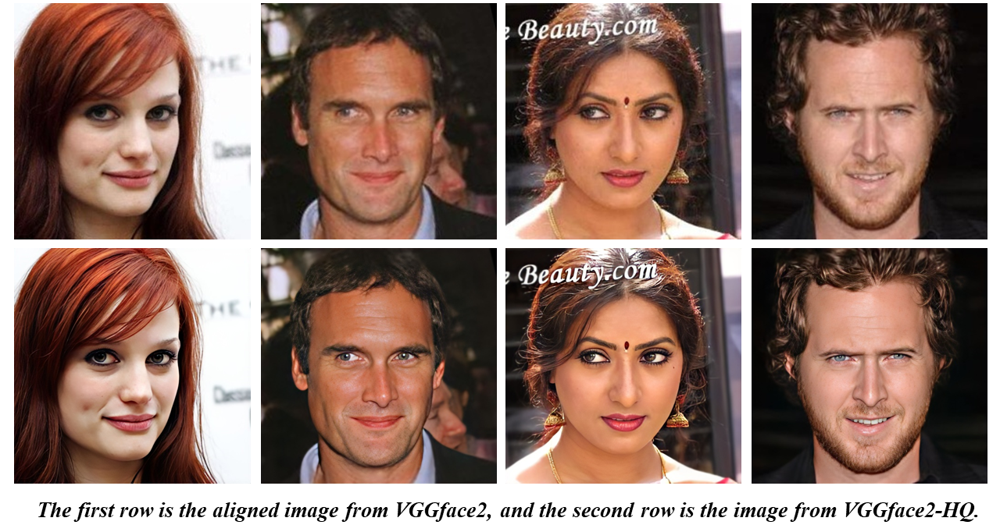

# RainNet: A Large-Scale Imagery Dataset and Benchmark for Spatial Precipitation Downscaling
# Accepted by NeurIPS 2022
Xuanhong Chen*, Kairui Feng*, Naiyuan Liu, Bingbing Ni**, Yifan Lu, Zhengyan Tong , Ziang Liu

\* Equal contribution
\*\* Corresponding author

[[Project Website]](https://neuralchen.github.io/RainNet) [[Paper]](https://arxiv.org/abs/2012.09700)

**The official repository with Pytorch**

[](https://github.com/neuralchen/RainNet)
[](https://github.com/neuralchen/RainNet)

## Top News 

**`2022-11-16`**: The download links are now avaliable: [[Google Driver] RainNet_HDF5.zip (13.6G)](https://drive.google.com/file/d/1cvzT3n9N7o06YhykdakOsboyqwTavkEP/view?usp=sharing) [[Baidu Driver] RainNet_HDF5.zip (13.6G)](https://pan.baidu.com/s/1hXa6Tr089KvBefCJIVQPuQ) [Password: sjtu].

**`2022-11-16`**: We are working for metric tools and annotation of events.

## Download RainNet

[[Download Via Google Drive] RainNet_HDF5.zip (13.6G)](https://drive.google.com/file/d/1cvzT3n9N7o06YhykdakOsboyqwTavkEP/view?usp=sharing) 

[[Download Via Baidu Drive] RainNet_HDF5.zip (13.6G)](https://pan.baidu.com/s/1hXa6Tr089KvBefCJIVQPuQ)
[password: sjtu]

## Resources in Zip:
***RainNet_HDF5.zip***

  &nbsp;&nbsp;&boxvr;&nbsp; $year$_07.hdf5
  
  &nbsp;&nbsp;&boxvr;&nbsp; $year$_08.hdf5
  
  &nbsp;&nbsp;&boxvr;&nbsp; $year$_09.hdf5
  
  &nbsp;&nbsp;&boxvr;&nbsp; $year$_10.hdf5
  
  &nbsp;&nbsp;&boxur;&nbsp; $year$_11.hdf5
  
  ***$year$=2002~2018***
  - ***85*** HDF5 files in total;
  - ***322GB*** of hard disk space is required to extract the dataset.

## Dependencies
- python3.6+
- pytorch1.5+
- torchvision
- h5py
- numpy

## Usage
- Data preparation. Run the 'dataset_prepare_hdf5.py' to process the dataset into patches. In 'dataset_prepare_hdf5.py', variable 'dataset_path' sets the hdf5 file path of RainNet; 'patch_hdf5_root' sets the target path to save processed dataset:

- ```python dataset_prepare_hdf5.py```

- We provide a example dataloader (pytorch script) to read the processed dataset:

- ```dataloader_hdf5.py```

- ***python scripts are archived in fold 'scripts'***

## Samples in RainNet

### High Resolution Precipitation Maps


### Low Resolution Precipitation Maps


## Citation
If you find this Dataset useful in your research, please consider citing:

```
@misc{chen2020rainnet,
  title={RainNet: A Large-Scale Dataset for Spatial Precipitation Downscaling},
  author={Xuanhong Chen and Kairui Feng and Naiyuan Liu and Yifan Lu and Zhengyan Tong and Bingbing Ni and Ziang Liu and Ning Lin},
  year={2020},
  eprint={2012.09700},
  archivePrefix={arXiv},
  primaryClass={cs.CV}
} 
```

## Contact
Please concat Kairui Feng [email](kairuif@princeton.com), Xuanhong Chen [email](xuanhongchenzju@outlook.com), Naiyuan Liu [email](naiyuan.liu@student.uts.edu.au) and Yifan Lu [email](yifan_lu@sjtu.edu.cn) for questions about the dataset. 

## Related Projects

**Please visit ou popular face swapping project**

[](https://github.com/neuralchen/SimSwap)

[](https://github.com/neuralchen/SimSwap)

**Please visit our high-quality style transfer project**

[](https://github.com/neuralchen/ASMAGAN)

[](https://github.com/neuralchen/ASMAGAN)

**Please visit our AAAI2021 sketch based rendering project**

[](https://github.com/TZYSJTU/Sketch-Generation-with-Drawing-Process-Guided-by-Vector-Flow-and-Grayscale)
[](https://github.com/TZYSJTU/Sketch-Generation-with-Drawing-Process-Guided-by-Vector-Flow-and-Grayscale)

**Please visit our high resolution face dataset VGGFace2-HQ**

[](https://github.com/NNNNAI/VGGFace2-HQ)

Learn about our other projects 

[[VGGFace2-HQ]](https://github.com/NNNNAI/VGGFace2-HQ);

[[RainNet]](https://neuralchen.github.io/RainNet);

[[Sketch Generation]](https://github.com/TZYSJTU/Sketch-Generation-with-Drawing-Process-Guided-by-Vector-Flow-and-Grayscale);

[[CooGAN]](https://github.com/neuralchen/CooGAN);

[[Knowledge Style Transfer]](https://github.com/AceSix/Knowledge_Transfer);

[[SimSwap]](https://github.com/neuralchen/SimSwap);

[[ASMA-GAN]](https://github.com/neuralchen/ASMAGAN);

[[SNGAN-Projection-pytorch]](https://github.com/neuralchen/SNGAN_Projection)

[[Pretrained_VGG19]](https://github.com/neuralchen/Pretrained_VGG19).